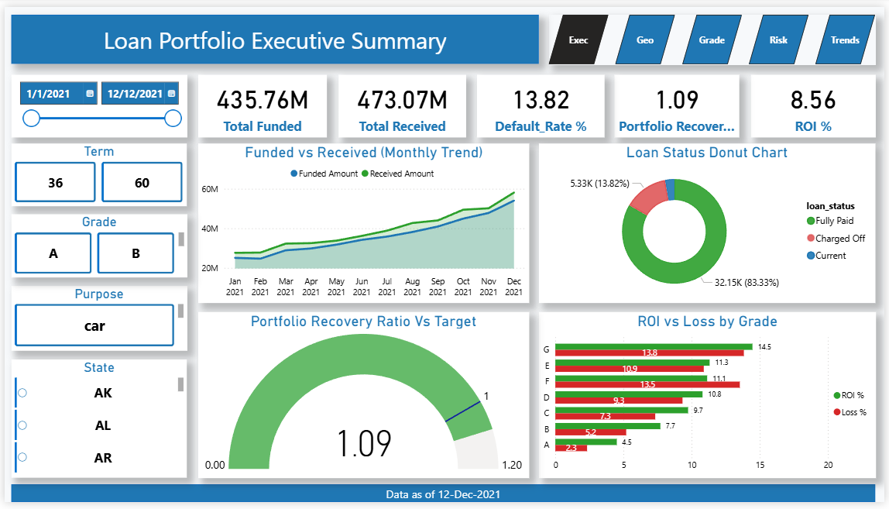
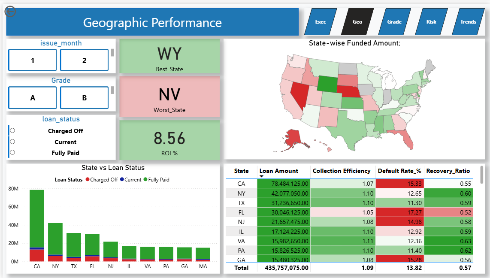
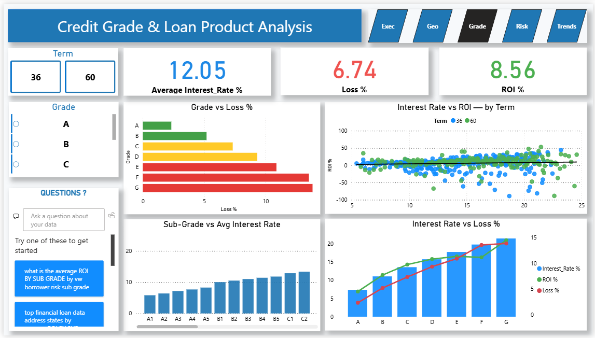
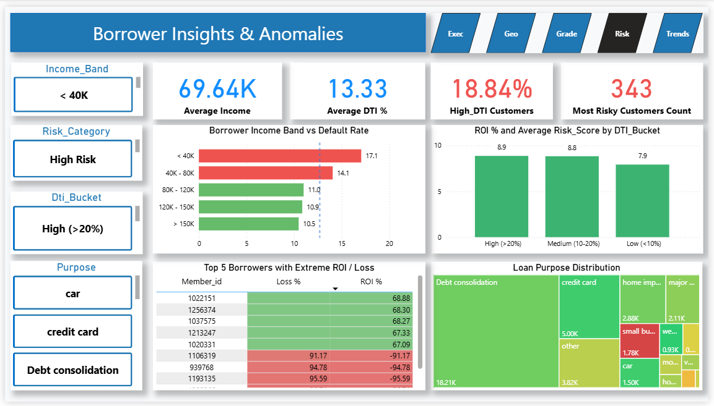
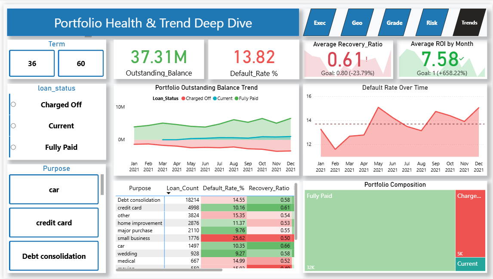

# Financial Loan Analytics System  

A Complete End-to-End Business Intelligence, Risk Analytics & Portfolio Monitoring Solution

<p>
  
  
  
  
</p>

---

## 📌 Project Summary

| Category       | Details |
|----------------|---------|
| **Domain**     | Financial Loan Analytics |
| **Objective**  | Analyze borrower profiles, credit risk, repayment patterns, and portfolio performance |
| **Dataset**    | 38,576 loan records × 24 features |
| **Deliverables** | Cleaned dataset, KPI models (SQL), analytical views, 5-page Power BI dashboard |
| **Tech Stack** | Python, MySQL, Power BI, Excel/CSV |
| **Business Impact** | Improved risk assessment, enhanced underwriting, optimized recovery strategy, stronger portfolio monitoring |

---

## 📊 Key Highlights at a Glance

- Processed **38,000+ loan records** across 24 borrower and credit attributes  
- Built **15+ core KPIs** including Default %, ROI %, Recovery %, and Loss Metrics  
- Identified **high-risk borrower segments** using DTI, income levels, and credit grades  
- Found **Grades E–G** to be the most loss-heavy and risk-prone  
- State-wise analysis revealed **major recovery and repayment gaps**  
- Developed **5 interactive Power BI dashboards** delivering leadership-ready insights  
- Completed a full **Python → SQL Modeling → Power BI** analytics pipeline  

---

## Repository Structure  
```
Financial-Loan-Analysis/
│
├── data/
│   ├── Clean_Financial_Loan_Data.csv
│   └── Financial_Loan_Data.csv
│
├── python/
│   └── Financial_Loan.ipynb
│
├── sql/
│   └── Financial_Loan_SQL.sql
│
├── dashboard/
│   └── Financial_Loan_Dashboard.pbix
│
├── docs/
│   └── Terminologies in Data.docx
│
└── README.md
```

---

# Executive Overview  
This project delivers a production-ready **Financial Loan Analytics Platform** designed to support **credit risk assessment, portfolio monitoring, and strategic decision-making** across lending institutions such as banks, NBFCs, and fintech companies.

Using Python, MySQL, and Power BI, the solution transforms raw loan-level data into a structured analytical ecosystem that enables:

- Early identification of high-risk borrower segments
- Monitoring repayment behaviour and delinquency trends
- Portfolio performance evaluation across geographies, credit grades, and income groups
- KPI-driven insights for underwriting, capital allocation, and recovery strategies 
- The solution transforms raw loan data into a complete analytics ecosystem involving:

The platform replicates real-world workflows used in financial analytics, incorporating data engineering, KPI modeling, and enterprise-grade business intelligence dashboards.

---

## 📑 Table of Contents

| No. | Section | Link |
|-----|---------|------|
| 1 | Problem Statement | [Go to Section](#-problem-statement) |
| 2 | Project Objectives | [Go to Section](#-project-objectives) |
| 3 | Project Workflow | [Go to Section](#project-workflow) |
| 4 | Dataset Description | [Go to Section](#-dataset-description) |
| 5 | Python Data Cleaning & Preprocessing | [Go to Section](#python-data-cleaning--preprocessing) |
| 6 | SQL KPI Modeling | [Go to Section](#-sql-kpi-modeling) |
| 7 | Power BI Dashboards | [Go to Section](#-power-bi-dashboards) |
| 8 | Insights & Findings  | [Go to Section](#-insights--findings) |
| 9 | Business Impact | [Go to Section](#-business-impact) |
|10 | Technologies Used | [Go to Section](#-technologies-used) |
|11 | Challenges & Learnings | [Go to Section](#challenges--learnings) |
|12 | Conclusion | [Go to Section](#-conclusion) |

---

# 🔍 Problem Statement  

Lending institutions lacked a unified analytics framework to evaluate borrower behavior, credit performance, and portfolio risk. Key gaps included:

- **No single view** of default patterns, recovery outcomes, and profitability  
- **Limited insight** into high-risk borrower groups (DTI, income, credit grade)  
- **Weak geographic visibility** into loan performance across states  
- **Minimal analysis** of delinquency trends, EMI behavior, and funded vs. received amounts  
- **No structured evaluation** of grade-wise and sub-grade risk concentration  

These gaps limited accurate credit decisioning, risk evaluation, underwriting precision, and collection strategies.  

**This project builds a full Python → SQL → Power BI analytics pipeline that converts raw loan data into actionable risk insights and portfolio intelligence.**

---
 
## 🎯 Project Objectives 

- Establishing a **clean, standardized dataset** suitable for reliable analytical modeling  
- Designing **core lending KPIs** to quantify risk, profitability, repayment behavior, and portfolio performance  
- Creating **SQL analytical views** for trend analysis, borrower segmentation, and cross-sectional insights  
- Delivering **Power BI dashboards** tailored for leadership, underwriting, and risk management teams  
- Generating **actionable insights** that enhance credit policies, strengthen underwriting processes, and support long-term portfolio strategy  

---

## Project Workflow

```

Raw Loan Data → Python Data Cleaning → Standardized Dataset → SQL KPI Modeling → Analytical Views (Trends, Segments, Risk) → Power BI Data Model → DAX Measures → Interactive Dashboards → Actionable Insights for Credit & Risk Teams

```

## 📂 Dataset Description  

The dataset used in this project contains detailed information on loan applications, borrower profiles, credit attributes, and repayment performance. It includes a total of **38,576 records** across **24 columns**.


### Columns Overview 

| Column Name | Description | Data Type |
|------------|-------------|-----------|
| `id` | Unique loan identifier | INT |
| `address_state` | State where the borrower resides | VARCHAR |
| `application_type` | Type of loan application (Individual/Joint) | VARCHAR |
| `emp_length` | Borrower’s employment duration | VARCHAR |
| `emp_title` | Borrower’s job title | VARCHAR |

*This table shows the first five columns.  
A full, detailed data dictionary is available in the notebook (`Financial_Loan.ipynb`).*

---

## Python Data Cleaning & Preprocessing  
**File:** `python/Financial_Loan.ipynb`

Key Preprocessing Activities:

- Ingested the raw loan dataset and conducted initial exploratory quality checks  
- Addressed missing, inconsistent, duplicate, and invalid records to ensure data integrity  
- Standardized categorical fields including employment details, home ownership, and verification attributes  
- Normalized key numeric variables such as interest rate, annual income, DTI, and installment amounts  
- Parsed, cleaned, and harmonized all date fields to support accurate time-based analysis  
- Created derived attributes to enable downstream KPI modeling and borrower segmentation  
- Exported the final validated dataset → `Clean_Financial_Loan_Data.csv`

---

## 🧮 SQL KPI Modeling  
**Script:** `sql/Financial_loan_data_sql_script.sql`

This stage established the analytical foundation by calculating core lending KPIs and structuring the data for BI reporting.

### ✔ KPI Framework Developed
- Good vs Bad Loan Classification  
- Default Rate (%)  
- Recovery Rate (%)  
- ROI % (Return on Investment)  
- Monthly Funded vs Received Amount  
- Grade-wise Loss and Profitability Metrics  
- Purpose-wise Loan Performance Indicators  

### ✔ Analytical Views Created
- Monthly issue-date trend view for portfolio monitoring  
- State-wise performance and recovery analysis  
- Grade and sub-grade scorecard for credit quality assessment  
- Borrower segmentation based on income, DTI, home ownership, and risk factors


## Sample SQL Query  

### 🔹 Monthly Trend Analysis  
```sql
SELECT 
  DATE_FORMAT(issue_date, '%Y-%m') AS month,
  SUM(loan_amount) AS funded_amount,
  SUM(total_payment) AS received_amount
FROM financial_loan_data
GROUP BY month
ORDER BY month;
```
---


## 📊 Power BI Dashboards  
**File:** `Financial_Loan_Dashboard.pbix`

### 📈 Dashboard Summary

| Dashboard | Purpose | Key Insights |
|----------|----------|--------------|
| **Executive Summary** | Portfolio overview & KPIs | ROI, Recovery %, Defaults, Trends |
| **Geographic Performance** | State-wise performance analysis | Heatmaps, recovery gaps, regional default patterns |
| **Credit Grade Analysis** | Credit grade & sub-grade evaluation | Grade-wise ROI, losses, risk clusters |
| **Borrower Risk** | Identifying borrower-level risks | High DTI cases, low income borrowers, anomalies |
| **Portfolio Trend** | Long-term performance monitoring | YOY default rate, ROI trends, purpose trends |

---

## 🖼 Dashboard Previews  

### **1️⃣ Executive Summary Dashboard**  
Provides an overview of portfolio-level KPIs including funded amount, received amount, ROI %, recovery %, and default trends.  
<br> 

### **2️⃣ Geographic Performance Dashboard**  
Shows state-wise loan activity, default patterns, and recovery variations through maps and regional visuals.  
<br> 

### **3️⃣ Credit Grade Analysis Dashboard**  
Highlights grade and sub-grade profitability, interest rate behavior, and loss concentration across borrower segments.  
<br> 

### **4️⃣ Borrower Risk & Anomaly Dashboard**  
Identifies high-risk borrower groups using DTI, income tiers, home ownership, and repayment irregularities.  
<br> 

### **5️⃣ Portfolio Trend & Health Dashboard**  
Visualizes monthly and yearly trends for ROI, defaults, funded vs received amounts, and purpose-wise patterns.  
<br> 

---

## 🔍 Insights & Findings

### 🔹 Portfolio Performance
- Loan disbursements show a steady upward trend over time.
- Recovery rates differ significantly across states, indicating regional risk variations.
- Several months exhibit a sizable gap between funded amount and received amount, signaling repayment stress.

### 🔹 Credit Risk Findings
- Borrowers with DTI > 25% demonstrate substantially higher default probability.
- Credit grades E, F, and G contribute to the majority of portfolio losses.
- Repayment performance is strongly influenced by employment stability and income levels.

### 🔹 Trend Observations
- Clear seasonal fluctuations appear in both repayment patterns and defaults.
- Debt Consolidation emerges as the most common loan purpose, dominating portfolio volume.
- ROI varies strongly across states, months, and borrower groups, suggesting diverse profitability patterns.

---

## ⭐ Business Impact

This analytics solution supports financial teams by:

- Improving early identification of high-risk borrower groups and potential defaults  
- Providing KPI-based visibility to strengthen underwriting judgments  
- Highlighting regional performance gaps to guide targeted recovery actions  
- Enabling consistent portfolio monitoring through automated dashboards  
- Helping allocate capital more effectively by revealing grade-level profitability patterns  

---

## 🧰 Technologies Used  

| Technology | Purpose |
|------------|---------|
| **Python (Pandas, NumPy)** | Data cleaning & preprocessing |
| **MySQL 8.0** | KPI modeling & analytical queries |
| **Power BI** | Dashboard development |
| **Excel/CSV** | Data ingestion & storage |

---

## Challenges & Learnings

- Managed multiple inconsistent date formats across the dataset.
- Standardized categorical fields and cleaned text-based attributes for analytical use.
- Designed flexible, scalable KPI logic to support SQL-based modeling.
- Developed optimized and dynamic DAX measures within Power BI.
- Ensured end-to-end data accuracy and consistency across the ETL → SQL → BI pipeline.

---

## 🏁 Conclusion  

This project delivers a streamlined, end-to-end Financial Loan Analytics platform that brings together:

- **Data Engineering and Preparation**  
- **KPI Modeling and Performance Measurement**  
- **SQL-Driven Analytical Processing**  
- **Interactive Business Intelligence Dashboards**  
- **Risk and Portfolio Evaluation Frameworks**  

The solution provides clear, data-backed insights that help financial teams strengthen risk assessment, improve monitoring practices, and support more informed lending decisions.  


---

## ⭐ Support  
If you like this project, please ⭐ star the repository — your support motivates future work!
